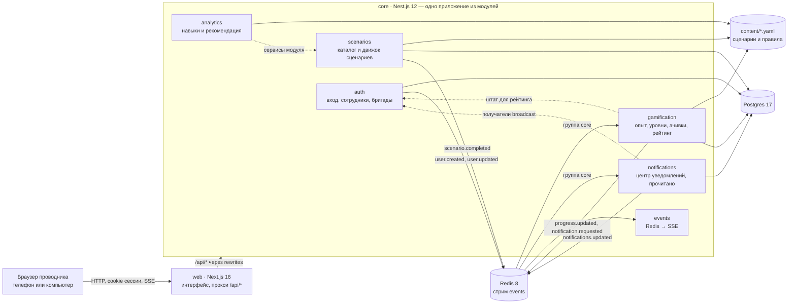
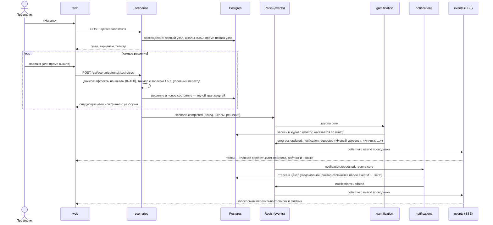

# Архитектура «Рейс 400»

Тренажёр проводника ВСМ-400: браузер работает только с веб-приложением, весь бэкенд — одно приложение Nest.js из модулей. Контент (сценарии и правила) — YAML-файлы, данные — Postgres, события — Redis Streams.

## Компоненты

- **Браузер ходит только на `web`.** Next проксирует `/api/*` в ядро, поэтому cookie и SSE работают с одного адреса.
- **Ядро — единственный бэкенд.** Модули подключаются строкой в `core/src/app.module.ts`.
- **Swagger** — `/api/docs`, описаны все эндпоинты ([README](../README.md#быстрый-старт)).

## Модули ядра

| Модуль | Отвечает за | Данные | Правила |
|---|---|---|---|
| `auth` | вход (JWT в httpOnly-cookie или Bearer), роли `USER` / `MANAGER` / `ADMIN`, сотрудники с бригадой и депо, синтетический штат | `users`, `refresh_tokens` | — |
| `scenarios` | каталог, прохождение: узлы, варианты, две шкалы, таймер на сервере, разбор; демо-история | `scenario_runs`, `scenario_decisions` | `content/scenarios/*.yaml`, движок `engine.ts` |
| `gamification` | опыт, уровни, репутация, ачивки, награда за прохождение, рейтинг за месяц | `gamification_runs` — журнал из событий | `content/gamification.yaml`, `rating.ts`, `achievements.ts` |
| `analytics` | навыки ролевой модели, слабый навык, какой сценарий потренировать | своей таблицы нет | `content/skills.yaml`, метки `skills` у вариантов, `skills.ts` |
| `notifications` | центр уведомлений: строка каждому получателю из `notification.requested`, список и счётчик непрочитанных, «прочитано» | `notifications_items` | `notification.ts` — получатели и содержимое |
| `events` | публикация в стрим `events`, чтение группой `core` с повторами и DLQ, доставка в браузер по SSE | Redis | [docs/events.md](events.md) |

**Модули не лезут в чужие таблицы** и не связываются через JOIN ([docs/database.md](database.md)). Чужие данные берутся двумя способами:
- **копией из события** — геймификация ведёт свой журнал из `scenario.completed`;
- **через экспортированный сервис** — аналитика читает решения через `RunsService`, рейтинг берёт штат через `UsersService`, уведомления — получателей рассылки на всех.

## Путь одного прохождения

Вход с обновлением токена, путь уведомления и повтор событий с DLQ — в [диаграммах последовательности](sequences.md).

## Ключевые решения

| Решение | Почему |
|---|---|
| **Сценарии и правила — YAML в `content/`**, читаются при каждом запросе | Методист правит развилку, очки или порог ачивки без программиста и без перезапуска. Сломанный файл сценария пропускается с причиной в логе, сломанные правила дают `500 CONTENT_INVALID`; тесты `content.spec.ts` ловят ошибки до коммита |
| **Движок — чистые функции** (`core/src/scenarios/engine.ts`) | Правила шкал, переходов и таймера проверяются тестами без базы и объясняются за минуту |
| **Таймер считает сервер** по времени показа узла | Нельзя «остановить время» в браузере: выбор после дедлайна засчитывается как таймаут. Запас 1,5 с — на задержку сети |
| **Опыт, ачивки, рейтинг и навыки считаются при чтении** из журнала и YAML | Правка правил сразу пересчитывает всех, нет миграций данных и рассинхрона. На объёмах тренажёра это быстро |
| **Связь модулей — события** (Redis Streams, группа `core`, повторы и DLQ) | Сценарии не знают о геймификации: новый потребитель (например, LMS) подключается к стриму, не трогая движок. Обработчики идемпотентны |
| **Одно Nest-приложение вместо микросервисов** | Для команды из пяти человек и двух дней — меньше инфраструктуры; границы модулей те же, что у сервисов, выделить их можно позже |

## Безопасность и данные

- **Вход:** короткий access-токен (15 минут) и refresh-токен с ротацией. Оба в httpOnly-cookie, в базе хранится только хэш refresh-токена.
- **Права проверяет ядро:** роли на эндпоинтах, чужое прохождение отвечает так же, как несуществующее.
- **Валидация всех входных данных:** `422 VALIDATION_ERROR`, лишние поля отбрасываются.
- **Только синтетические данные** (152-ФЗ): демо-сотрудники и штат из 35 вымышленных проводников.
- **Порты сервисов открыты только на `127.0.0.1`.** Пароли в `docker-compose.yml` — только для разработки.
