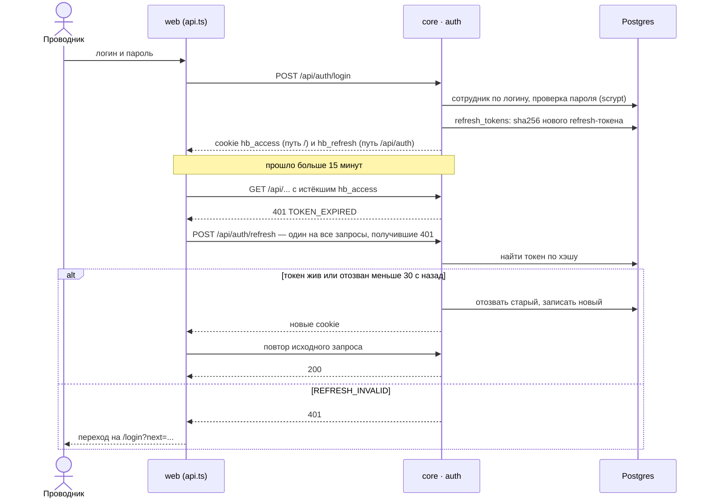
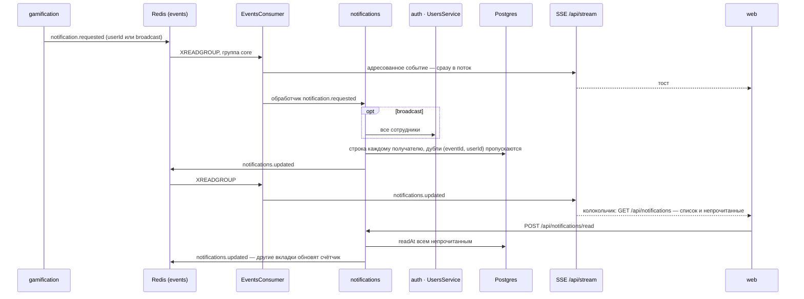
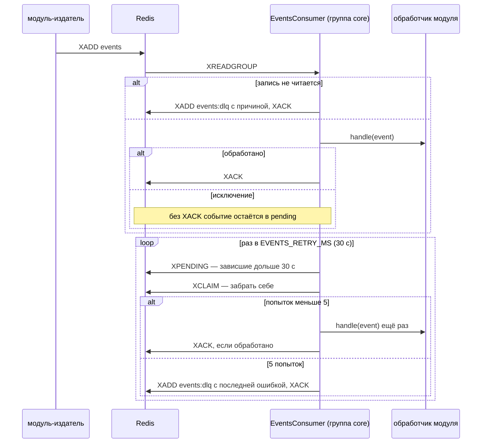

# Диаграммы последовательности

Главный путь — одно прохождение сценария — в [README](../README.md#путь-одного-прохождения) рядом со схемой компонентов. Здесь — три служебных пути, на которых держится демо: вход, уведомления и надёжная доставка событий. Картинки для слайдов — в [docs/diagrams/](diagrams/), PDF со схемой компонентов и путём прохождения — [gornweb.online/architecture.pdf](https://gornweb.online/architecture.pdf) (файл `web/public/architecture.pdf`).

## Вход и обновление токена

Access-токен живёт 15 минут, refresh — дни. Браузер не видит токенов: оба лежат в httpOnly-cookie, в базе — только хэш refresh-токена.



- **Запас 30 с после ротации** — две вкладки или повтор при плохой связи не выкидывают пользователя.
- **Refresh-cookie уходит только на `/api/auth`**, остальные запросы его не несут.

## Уведомление до браузера

Любой модуль публикует `notification.requested` с `userId` или `broadcast: true` — дальше ядро доставляет его само.



- **Тост приходит раньше записи в базу:** браузеру не нужно ждать Postgres. Список перечитывается по `notifications.updated`, когда строка уже записана.
- **SSE отдаёт пользователю** только события с его `userId` и `broadcast`, раз в 25 с — `ping`.

## Повтор событий и DLQ

Ядро читает стрим `events` группой `core`. Событие подтверждается (`XACK`) только после успешной обработки.



- **Обработчики идемпотентны:** одно событие может прийти дважды. Геймификация отсекает повтор по `runId`, уведомления — по паре `eventId` и `userId`.
- **Если Redis недоступен,** цикл ждёт 2 с и пересоздаёт группу. Разбор DLQ — `XRANGE events:dlq - +` ([события](events.md)).

## Как обновить картинки

Источник картинок — Mermaid в корневом README (схема компонентов и путь прохождения) и в этом файле. SVG для слайдов пересобираются из корня репозитория (нужен Node, при первом запуске npx скачает Chromium):

```bash
npx -y @mermaid-js/mermaid-cli@12 -i README.md -o docs/diagrams/architecture.md -b white
```

```bash
npx -y @mermaid-js/mermaid-cli@12 -i docs/sequences.md -o docs/diagrams/sequences.md -b white
```

Рядом появятся `architecture-1.svg`, `architecture-2.svg`, `sequences-1.svg`…; сгенерированные `.md` в `docs/diagrams/` удалить.
