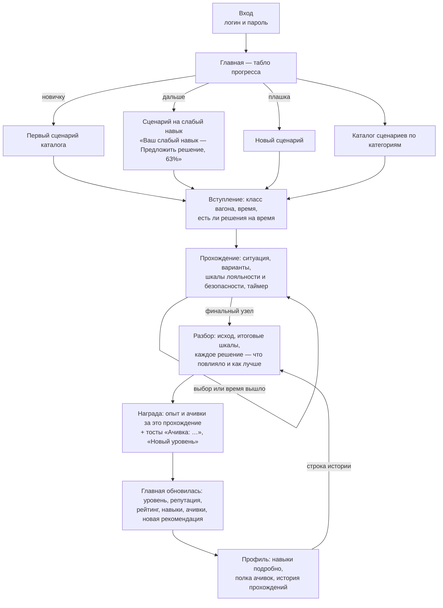
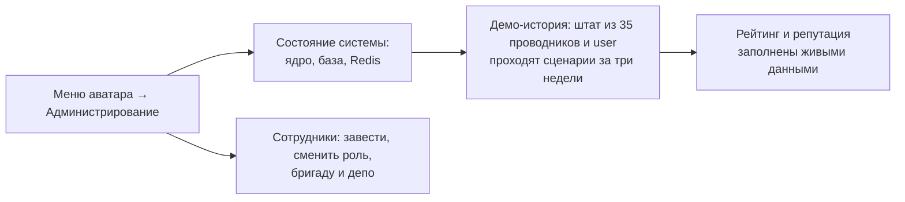
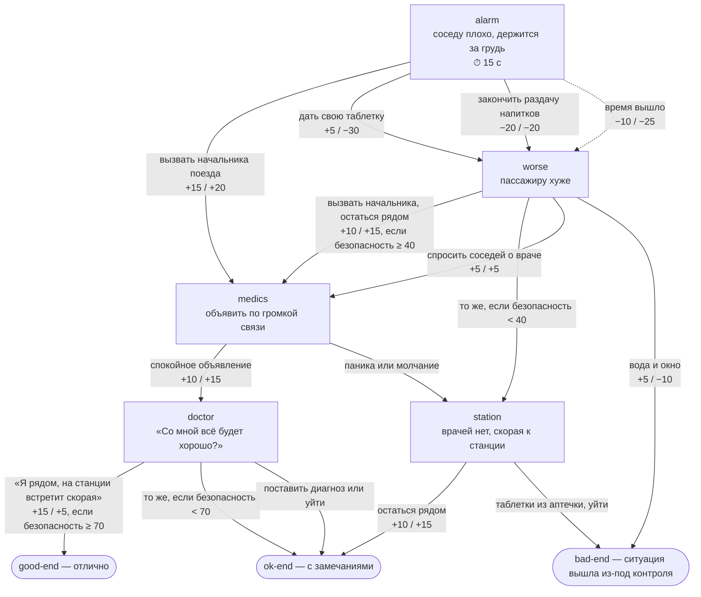

# User Flow и примеры сценариев

## Путь проводника

**Главная** — одна страница со всем циклом мотивации:
- главная карточка — что пройти дальше и почему;
- уровень — состав из шести вагонов, 60 → 400 км/ч;
- репутация — средние шкалы за 10 прохождений и тренд за неделю;
- рейтинг бригады, депо и компании за месяц;
- радар шести навыков;
- сколько сценариев пройдено;
- ачивки: последняя и следующая с прогрессом.

## Путь администратора

Методист правит контент без программиста — YAML в `content/`, изменения видны сразу, без перезапуска (рецепты — в [docs/content.md](content.md#правка-при-жюри)).

## Пример сценария: «Пассажиру плохо на 400 км/ч»

Файл [content/scenarios/sick-passenger.yaml](../content/scenarios/sick-passenger.yaml), по памятке «Ситуации на борту» №19 и №28. Категория — медицина и безопасность, класс «Комфорт», одно решение на время (15 секунд).

Подписи стрелок — изменение шкал «лояльность / безопасность». Шкалы стартуют с 50 и обрезаются до 0–100. Условия проверяются после применения эффектов выбранного варианта.

### Три прохождения

| | Лучший путь | Замешкался | Своя таблетка |
|---|---|---|---|
| **Решения** | вызвать начальника → спокойное объявление → «Я рядом» | время вышло → вызвать начальника → спокойное объявление → «Я рядом» | своя таблетка → вызвать начальника → остаться рядом |
| **Шкалы по шагам** | 65/70 → 75/85 → 90/90 | 40/25 → 50/40 → 60/55 → 75/60 | 55/20 → 65/35 → 75/50 |
| **Переход, который решило условие** | в `doctor` безопасность 90 ≥ 70 → `good-end` | в `worse` 40 не меньше 40 → к медикам; в `doctor` 60 < 70 → `ok-end` | в `worse` 35 < 40 → сразу к станции |
| **Исход** | отлично | с замечаниями | с замечаниями |
| **Опыт** | +150 | +100 | +100 |
| **Ачивки** | «Первая помощь», «Холодная голова» | «Холодной головы» нет: был таймаут | — |
| **Навыки** | верно: признать ситуацию, безопасность, заверить, хладнокровие | промах в «признать ситуацию», «безопасности» и «хладнокровии» на первом узле | промах в «признать ситуацию» и «безопасности» на первом узле |
| **Разбор** | «Верно и быстро — ровно так, как в памятке» | «Пока вы решали, пассажиру стало хуже…» | «Личные лекарства давать нельзя…» |

Одинаковый финальный ответ даёт разный исход — важна вся цепочка решений. Это и есть нелинейность: шкалы копятся и через условия меняют развилки.

## Другие сценарии

| Сценарий | Категория | Чему учит | Решения на время |
|---|---|---|---|
| Посадка без билета | Посадка | ролевая модель целиком: признать, обозначить правило, предложить решение, заверить | нет |
| Два пассажира на одно место | Конфликты | не занимать сторону, пригласить начальника поезда, развести конфликт | 20 с на потасовку |
| Пассажиру плохо на 400 км/ч | Медицина и безопасность | неотложная помощь в приоритете, не давать лекарства | 15 с |
| Минутная стоянка | Сервис | безопасность на стоянке в одну минуту, забота о пассажире | 20 с и 10 с |
